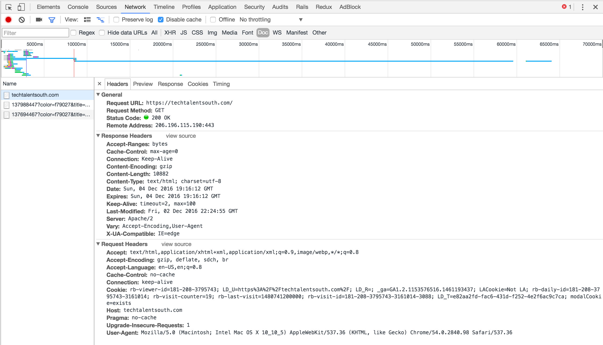
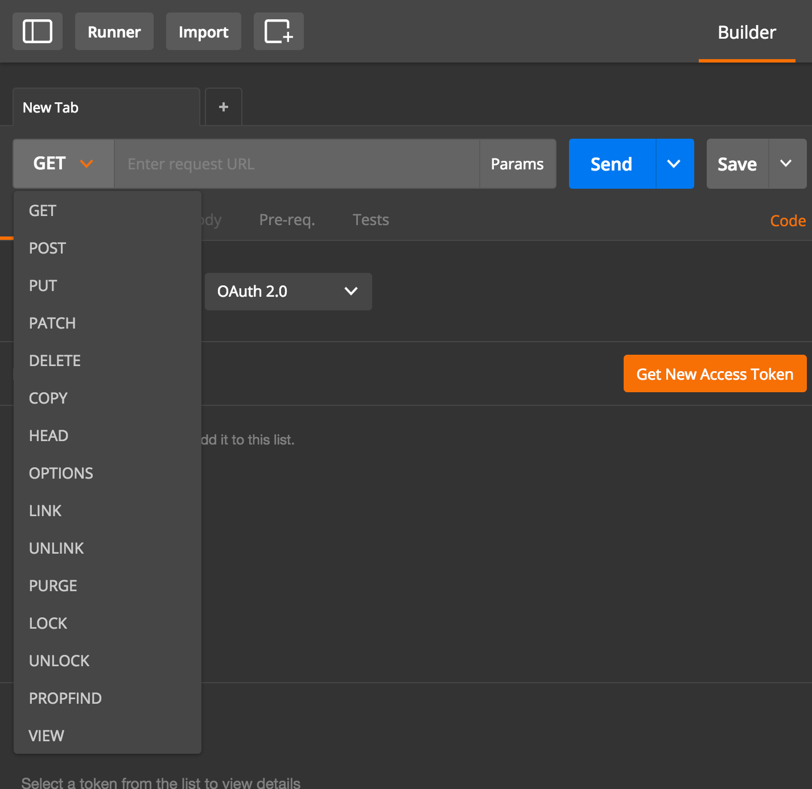
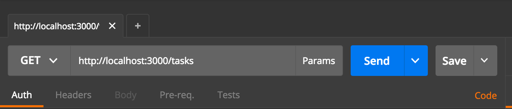
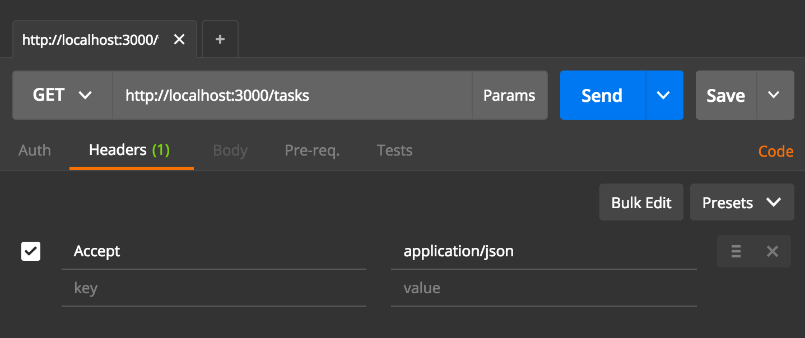
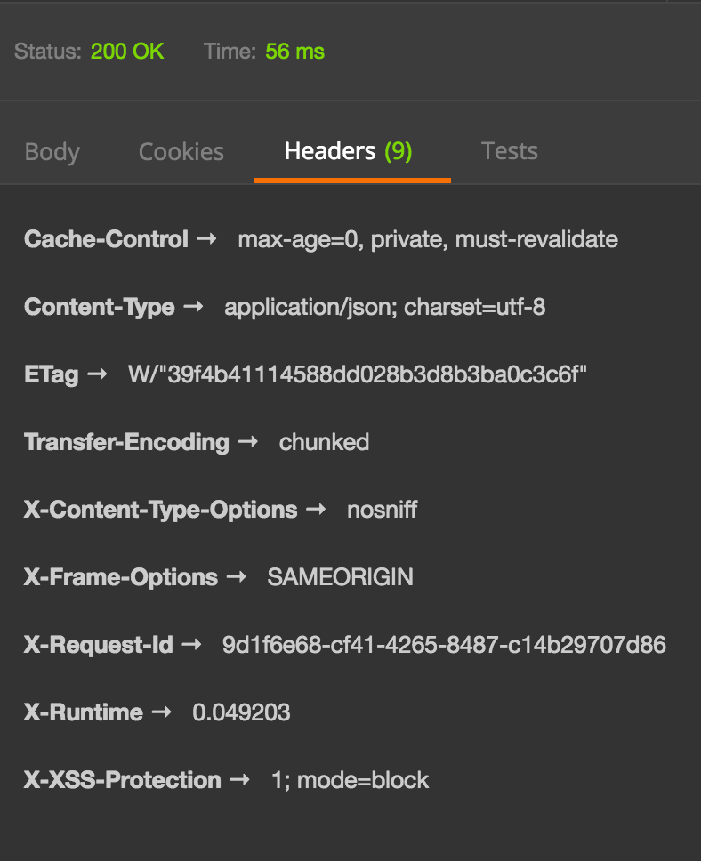
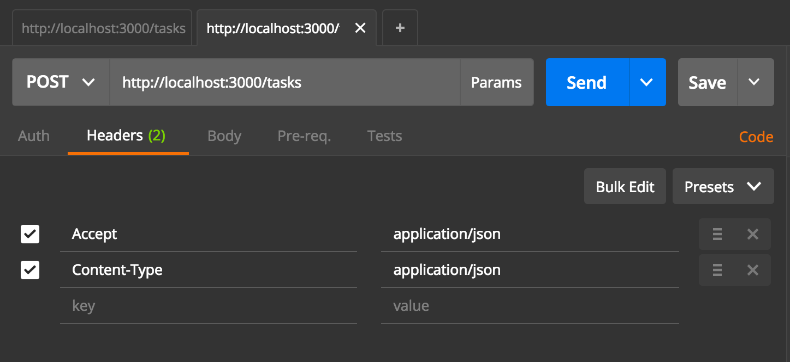
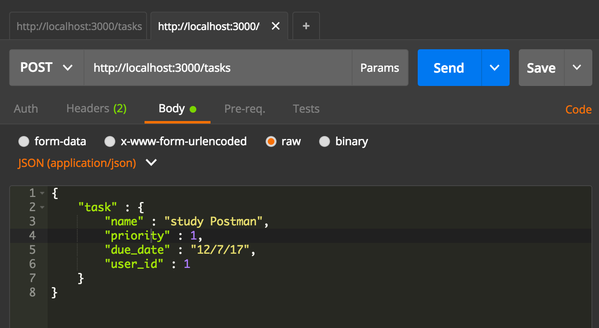
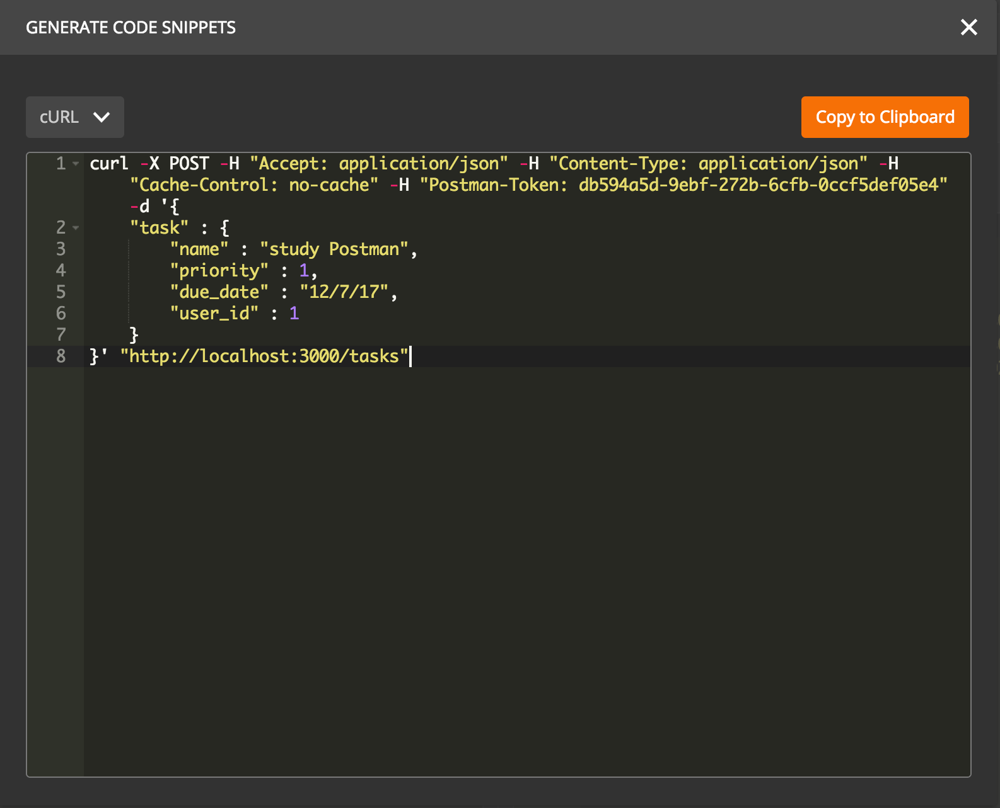
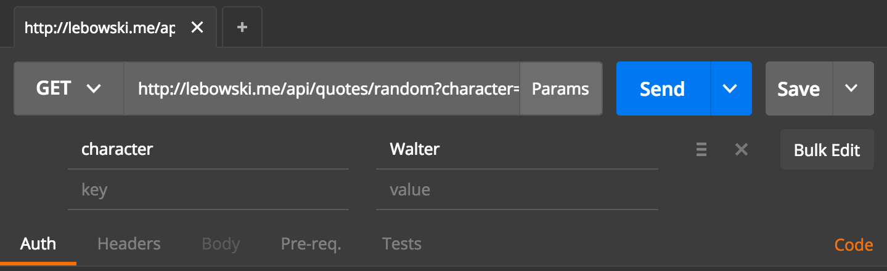

# Lesson 5 - Moving towards API's

## Recap & Agenda

Over the past classes, we've focused primarily on testing. In that time we have covered the fundamentals of testing  Rails applications. While there is more to cover in relation to testing, we are going to shift gears and begin focusing on working with and building API's. 

In this class we will be covering:

- Intro to REST architecture
- HTTP fundamentals 
	- HTTP verbs
	- HTTP Request & Response
	- HTTP Status Codes
- cURL
- Postman
- Working with API's

The objective tonight is to for you to become aware and familiar with the foundational principles necessary for building API's. 

## REST 
	
So you've heard and read many times before that Rails provides a RESTful architecture for building applications. It is my belief that the term *RESTful architecture* is often glossed over. The idea of REST is common within our day to day use of the web, which is why it comes so naturally. Yet the mechanics of REST takes work and effort to understand. 

Our goal within this class is not to understand REST at a computer science level. However, I do want to take a few minutes and frame REST in the context of building applications (more-specifically API's) within Rails. 

REST is an acronym that stands for: 

- REpresentational 
- State
- Transfer

Let's start by looking at [Wikipedia's Description of Representational State Transfer](https://en.wikipedia.org/wiki/Representational_state_transfer) 
> Representational state transfer (REST) or RESTful web services are one way of providing interoperability between computer systems on the Internet. REST-compliant web services allow requesting systems to access and manipulate textual representations of web resources using a uniform and predefined set of stateless operations... 
> In a REST web service, requests made to a resource's URI will elicit a response that may be in XML, HTML, JSON or some other defined format. The response may confirm that some alteration has been made to the stored resource, and it may provide hypertext links to other related resources or collections of resources.

What this means to us is that our client sends *representations* of objects to the server. The server then does something with that representation (ie: create, read, update, destroy), and returns a response (often with a *representation* of an object stored on the server). This is known as *state transer*. Once the client receives the response, the *state* of the client is updated. 

## HTTP

The principles of REST came from the genius of [Roy Fielding](http://roy.gbiv.com/) and was in many ways built with HTTP in mind. While REST can be used in other types of computer based communication, HTTP is the primary vehichle in which you will see used. 


HTTP is deserving of an entire TTS course in and of itself. Thankfully, you are already familiar with many of the fundamentals. 

As stated in the Agenda, our goal in this lesson is to understand the basics of HTTP that relate to building an API 

Those fundamentals are: 

- HTTP verbs
- Request & Response
	- Headers
	- Body
- HTTP Status Codes
- Statelessness 

### HTTP verbs

Thankfully, you already understand HTTP verbs due to your experience with building Rails applications. 

The most commonly used HTTP Verbs are: 

- GET
- POST
- PUT
- PATCH
- DELETE

Which map perfectly to standard CRUD operations. 


### the introduction example

Class example/exercise: 

- 2 students will come to the front of the class.
	- 1 will act as a client
	- 1 will act as the server
- The client student will say: 
	- Hi, what's your name? 
	- this simulates a GET request
- The server student will respond with their name
	- this simulates an HTTP response
- The client student will then say: 
	- Nice to meet you (inserting name variable), how are you? 
	- this will represent the client updating it's state and issuing another request


This basic little example should give a bit of insight into how the server-client model works, and how data is transferred over HTTP.      

### Request & Response

This should also be familiar. As you just saw in the example...

The client initiates a request via HTTP and the server sends a response via HTTP.

HTTP Requests usually consist of the following: 

- Request Line
- Headers
- Body

Simply explained... 

The **Request Line** contains the HTTP action (GET, POST, PUT, etc), the URI (also known as the endpoint or path), and the version of HTTP being used. 


#### Headers 

**Headers** are essentially information about the Request and Response. The exist as KEY/VALUE pairs. Yes! Like hashes or JSON objects :)

The header *keys* are predefined according the the HTTP spec. We as the developer can set the value based on a number of options, and can be broken up into 3 primary categories: 

- General: both request and response use them
- Request: request only
- Response: response only

The most common HTTP headers while building API's are: 

##### Accept

`Accept` which is used via request to specify what type of response is acceptable. ie: 

- `text/html`
- `text/csv`
- `text/plain`
- `application/json`
- `application/xml`
- `application/pdf`

The values above are known as **[MIME types](https://developer.mozilla.org/en-US/docs/Web/HTTP/Basics_of_HTTP/MIME_types)**. According to Mozilla...

> The MIME type is the mechanism to tell the client the variety of document transmitted: the extension of a file name has no meaning on the web. It is, therefore, important that the server is correctly set up, so that the correct MIME type is transmitted with each document. Browsers often use the MIME-type to determine what default action to do when a resource is fetched.

MIME types have a specific structure of `type/subtype` which (again according to Mozilla)

> consists of a type and a subtype, two strings, separated by a '/'. No space is allowed. The type represents the category and can be a discrete or a multipart type. The subtype is specific to each type.

For example, the type of `application` represents binary data, while `text` represents human readable data. The subtype then is more specific about the format of the data. 

##### Content-Type

`Content-Type` - used in `POST` and `PUT` requests - defines the *MIME type* of the body of the request. 


##### Authorization 

`Authorization` obviously contains authorization information. Usually in the form of:

```
Authorization : credentials
```

Authorization is outside of the scope of this particular lesson. We will look to cover it in the future.  

For a good introductory explanation of Authentication within the context of building applications, check out this [RisingStack](https://blog.risingstack.com/web-authentication-methods-explained/) article. 


##### User-Agent

`User-Agent` supplies the server with information about the client that is making the request. 

For example:

```
User-Agent:Mozilla/5.0 (Macintosh; Intel Mac OS SOME_VERSION_HERE) Chrome/VERSION_NUMBER_HERE 
```


You can view the full list of HTTP header KEYS [here](https://en.wikipedia.org/wiki/List_of_HTTP_header_fields) and [here](https://www.ntu.edu.sg/home/ehchua/programming/webprogramming/HTTP_Basics.html)


#### Request Body

The request body, also known as the *payload* is the representation we've been talking about. 

For example, when a user submits a form, the form data is sent in the request body. In rails, you'll find this information in our params. Within our Todo Application it might look like: 

```ruby
"task" => {
  "name"=>"Build an API", 
  "priority"=>"1", 
  "due_date"=>"12/5/17", 
  "user_id"=>"1"
}
```

When working with API's often the client will send this information as JSON. The server will take that representation, do something with it, and provide a JSON representation as a response. 


<!-- SOME EXAMPLE HERE -->


The [Anatomy of an HTTP POST Request](https://www.safaribooksonline.com/library/view/head-first-servlets/9780596516680/ch01s14.html) has an excellent description and image deomonstrating a `POST` request, that would be well worth reading and reviewing. 


## cURL

Now that we have a foundation for http, we can dig in to using a handy little tool named [cURL](https://curl.haxx.se/)

cURL stands for client URL and according to the documentation: 

> curl is a tool to transfer data from or to a server, using one of the supported protocols (DICT, FILE, FTP, FTPS, GOPHER, HTTP, HTTPS, IMAP, IMAPS, LDAP, LDAPS, POP3, POP3S, RTMP, RTSP, SCP, SFTP, SMB, SMBS, SMTP, SMTPS, TELNET and TFTP). The command is designed to work without user interaction.

Meaning that we can use cURL to issue URL **requests** on resources, outside of the browser. 

You'll probably find yourself using cURL most often from the command line, but it's also worth mentioning that cURL is used in cars, routers, printers, phones, and Internet of Things devices like smart TV's and smart appliances. 

We will be focusing on cURL with http. 

Sending a GET request with cURL is quite easy, you simply type `$ curl http://DOMAIN_GOES_HERE/URI_GOES_HERE`

let's look at a couple of examples, 

to check the weather we can `curl` to `http://wttr.in/CITY_NAME_HERE` and get a 3 day weather forecaset

```shell
$ curl http://wttr.in/Charlotte
```

using the same service, we can `curl` to `http://wttr.in/Moon` to see the current moon phase

```shell
$ curl http://wttr.in/Moon
```

You can use curl for all kinds of fun things. Let's `curl` the [starwars API](https://swapi.co/documentation) for a list of starships

```shell
$ curl http://swapi.co/api/starships/
```

Here you can see we get a JSON **response** listing all the starships. 

We can get even more specifec and use *query params* to search for a character by name: 

```shell
$ curl -X GET "https://swapi.co/api/people/?search=chewbacca"
```

This request looks slightly different. First, we are using `-X`, the default action of cURL is `GET`. Because we're using paramters at the end of our URL, it's a good idea to wrap our URL in quotes (to make it easier to type without escaping characters). This is where `-X` comes in. 

if we run `$ curl --help` we will see many different flags that can be used within our curl requests. 

the info associated with `-X` is: 

> -X --request COMMAND  Specify request command to use


`-X` is a flag that says, _I'm overriding the default behaviour curl to issue this request_. This allows us to not only easily add query params. It also allows us to issue `POST`, `PUT`, `PATCH` and `DELETE` requests as well. 

We can also, use curl inside of our ruby applications! There are several gems that aid in this process, but for now, let's just use good ol' IRB and curl against the [Internet Chuck Norris Database](http://www.icndb.com/api/) for a random *chuck norris fact*

```ruby
>> `curl http://api.icndb.com/jokes/random`
```

In order for this to work, we need to use the ``` ` ``` (back-tick character) around our request. Otherwise, the ruby interpereter will throw an error. 

We get back a random chuck norris fact in JSON format. Which is useful, but let's say we just wanted to get at the fact and store it as a variable. 

```ruby
>> require('JSON')
>> response = JSON.parse(`curl http://api.icndb.com/jokes/random`)
>> value = response['value']
>> fact = value['joke']
```

Here we are 

- requiring and using the ruby's JSON library
- parsing the curl request
	- which turns our response value into a hash 
- looking up the value hash within on our response hash
- looking up the joke/fact within our value hash

We could also string this all together in one line:
	
```ruby
>> fact = JSON.parse(`curl http://api.icndb.com/jokes/random`)['value']['joke'] 
```

Now, while this is all fun and games, we can also curl websites

```shell
$ curl http://www.techtalentsouth.com
```

This will bring back a giving us a resposne code of 301 and telling us the document has permanently moved to `http://techtalentsouth.com`. If we curl that url...

```shell
$ curl http://techtalentsouth.com
```

We will get another 301 reponse code telling us the URL is `https://techtalentsouth.com`. Let's curl that.

```shell
$ curl https://techtalentsouth.com
```

This gives us back the actual index page. 

We could also curl to just get the header by using `-I`

```shell
$ curl -X GET -I "https://techtalentsouth.com"
```

This can be incredibly useful to evaluate the repsonse headers of a site or an application. 

We can also use the `-L` flag to follow the redirects to the right place

```shell
$ curl -L http://www.techtalentsouth.com
```

#### devtools network

If we open chrome and navigate to the [TTS website](https://techtalentsouth.com), we can open the **network** tab in devtools to actually view the response and inspect the headers.

Open the devools panel by pressing `cmd` + `shift` + `i` click on noetwork and then select the Doc filter and you'll see something similar to this:



This can also be very useful for checking responses, debugging, etc.

#### POSTing with curl

As we saw earlier, there are many flags we can use with curl. One of the others you will find yourself using quite often is `-d`. Which allows us to `POST` data. 

If we open our TodoApp, we can actually use curl to create a new Task. Before doing this, we'll need to make a couple of modifications. 

##### An aside on authorization...

Navigate to `app/controllers/application_controller.rb` and change `protect_from_forgery with: :exception` to `protect_from_forgery with: :null_session`

```ruby
class ApplicationController < ActionController::Base
  protect_from_forgery with: :null_session
end
```

According to the [Rails Documentation](http://api.rubyonrails.org/classes/ActionController/RequestForgeryProtection/ClassMethods.html)

> `:exception` - Raises ActionController::InvalidAuthenticityToken exception.

and

> `:null_session` - Provides an empty session during request but doesn't reset it completely. Used as default if :with option is not specified.


This gets into security topics which can and should be discussed at a later time. However, what we need to know is that Rails automatically injects an auth token when requests are made from the browser. This protects from malicious scripts being sent along with form data. 

This works great for normal MVC apps, but not so well with API's as the client is not necessarily the browser. 

changing our `:null_session` allows us to use an empty session. This is enough for now, but please note that normally, you will set up some other form of authentication for your API such as: [Knock](https://github.com/nsarno/knock), [Devise Token Auth](https://github.com/lynndylanhurley/devise_token_auth) or [Simple Token Authentication](https://github.com/gonzalo-bulnes/simple_token_authentication). 

Again, this topic could be discussed at length and is very worthy of your own personal pursuit. *As developers, we must take security seriously*.


Next, let's temporarily disable our `authenticate_user!` `before_filter` in the tasks_controller. 

```ruby
class TasksController < ApplicationController

  before_action :set_task, only: [:show, :edit, :update, :destroy]
  
  # before_action :authenticate_user!
```

Now, we can create a curl request. *note: make sure your rails server is running*

```shell
$ curl -X POST  -H "Content-Type: application/x-www-form-urlencoded" -d 'task[name]=create a task with cURL&task[priority]=1&task[user_id]=1&task[due_date]=12/05/17' "http://localhost:3000/tasks/"
```

We've used several flags here, let's break down the new ones:

`-H` - Header

We've used `-H` to specify our **HTTP header's Content-Type** we have set the Content-Type to `application/x-www-form-urlencoded` to simulate a web-form. 

`-d` - data

The flag `-d` specifies the data we are submitting/posting. Here, we've just mimicked our form fields within the application. 

- `task[name]=create a task with cURL`
- `task[priority]=1`
- `task[user_id]=1`
- `task[due_date]=12/05/17`

If we naviagate to `http://localhost:3000/tasks` in our browser, we will see that the task has been added. 

We can also review the server log for details about the transaction. 

Another popular way of submitting data is through JSON 

let's set up our controller to work with JSON submissions

```shell
$ curl -X POST -H "Content-Type: application/json" -d '{"task": {
"name": "submit task with JSON using cURL",
"priority": "1",
"due_date": "12/5/17",
"user_id": "1"
  }
}' "http://localhost:3000/tasks/"
```

Refreshing our page, we can see this works as well. 

However, we got a response in html. Often with API's you'll want to return a response in JSON. Let's modify our controller to do that. 

```ruby
def create
  @task = Task.new(task_params)
  respond_to do |format|
    if @task.save
      format.json { render json: @task, status: :ok}
    else
      format.json { render json: {:errors => @task.errors.full_messages}, status: 422 }
    end
  end
end
```

Here, we are setting the respond to `json` and redering the newly created task. We are also supplying an http response code of `200`

```shell
$ curl -X POST -H "Content-Type: application/json" -H "Acccept: application/json" -d '{"task": {
"name": "respond with JSON",
"priority": "1",
"due_date": "12/5/17",
"user_id": "1"
  }
}' "http://localhost:3000/tasks/"
```

We can also submit an invalid task request and return an error:

```shell
$ curl -X POST -H "Content-Type: application/json" -H "Acccept: application/json" -d '{"task": {
"name": "respond with JSON",
"due_date": "12/5/17",
"user_id": "1"
  }
}' "http://localhost:3000/tasks/"
```

This should result in a validation error. 


### HTTP status codes

This leads us into working with status codes. 

According to [Mozilla](https://developer.mozilla.org/en-US/docs/Web/HTTP/Status) 

> HTTP response status codes indicate whether a specific HTTP request has been successfully completed. Responses are grouped in five classes: informational responses, successful responses, redirects, client errors, and servers errors.

I like to think of status codes being grouped into 5 different families...

- `100`'s represent information
- `200`'s represent successful actions
- `300`'s represent redirects (as seen earlier)
- `400`'s represent client errors
- `500`'s represent server errors

Within each family/group of responses, we can find specific responses. Check out the [REST API tutorial](http://www.restapitutorial.com/httpstatuscodes.html) for details on each status code. 

Also, if we use the `-i` flag in our curl request, we will see the response header, which includes our status code. 

```shell
$ curl -i -X POST -H "Content-Type: application/json" -H "Acccept: application/json" -d '{"task": {
"name": "Check the status code",
"priority": "1",
"due_date": "12/5/17",
"user_id": "1"
  }
}' "http://localhost:3000/tasks/"
```

## Revisiting REST

Now that we've talked some of the fundamentals of HTTP, I hope that REST is starting to make sense. Basically, if we use HTTP in the way it was inteded, we can easily build our applications with a REST architicture. 

This is due to the fact that we are making requests with *representations* and responding with *representations*. As a result of this *transfer*, our client's *state* is modified. 

## Postman

While curl is an excellent tool, [Postman](https://www.getpostman.com/) is another option that has an excellent UI and works well for http requests. In fact, Postman is built with API's in mind. 

If you haven't installed Postman yet, head on over their website and download the Chrome app or macOS version. 

The layout of Postman is pretty straight-forward. You have 2 panels to work with. One for requests and one for responses. Personally, I prefer the split/panel view as it puts everything I need to know in one view. (this can be enabled by going into settings and activating two-pane view)

By clicking on the dropdown within the request tab, you will see the http actions we discussed earlier 



We can issue a simple GET request to our TodoApp task index, by simply adding the URL: `http://localhost:3000/tasks`



Currently our repsonse is the tasks index page. The output in our response view is in html. <br> *note: you can click on the preview tab to see your actual output in the browser*

Let's update our controller to return JSON. Navigate to your Tasks Controller and update the index action. 

```ruby
def index
  @tasks = Task.all

  respond_to do |format|
    format.json { render json: @tasks }
  end
end
```

Now, in Postman, let's go ahead and add our `Accept` Header. 

click on the *Headers* tab and add `Accept` for the key and `application/json` for the value



After submitting the request, you'll see that our response view has output JSON for us! yay!

You'll aslo notice the status code at the top of the request, and a tab for checking cookies, headers and tests. *yes! you can even write tests for postman*

 

Let's `POST` a new task with Postman

First, we'll change the type of request to POST and send it to the same URL `http://localhost:3000/tasks`



Next we'll add some `Accept` and `Content-Type` headers. Both will contain the value `application/json`

After that, we'll create a request body by: 

- clicking on the Body tab
- selecting raw
- adding JSON data for a new task



In the response body, you'll see some nice JSON output with a status code of `200`. 

Postman, has a lot of other excellent features that we'll continue to explore throughout the rest of the course. A couple that I wanted to point out immediatly though, are the ability to save requests and generate code

By clicking the Save tab, we can create a new collection and store requests for later use and testing. 

This can be a huge time-saver that I recommend you get into the habit of using. 

The Code option will actually generate some basic code for many different languages. For a moment, check out the cURL option. 



## Working with API's 

Before we start building API's, we are going to explore a couple of API's and get used to the mechanics. 

We'll start by working with the [Lebowski API](https://github.com/aackerman/lebowski-api) by [Aaron Ackerman](https://twitter.com/_aaronackerman_)

Reviewing the documentation, you'll see that there following endpoints are listed. 

```ruby
/api/script
/api/quotes/random
/api/quotes/search?term=that+poor+woman
/api/quotes/:id
/api/lines/search?term=mountain
/api/lines/random
/api/lines/:id
```

We can clone this down and run curl or postman requests directly agains the local app, or query against the production app. For the sake of time, we are going to work with the production API. Which can be found at `http://lebowski.me`

Try it out by issuing a `GET` request to: `http://lebowski.me/api/quotes/random`

We can also use Query Params in postman to get more specific. Click on the Params button in postman and add your key value pair



We can also take this API and build a front-end for it, if we so choose. Check out [lebowski-front-end](https://github.com/shanebarringer/lebowski-front-end) to get an idea of how this might work. 


<!-- potential exercise: 
  have them spin up a new app that has an index and create action and only works with json
-->


## Homework

###**Due 12/7/16**

- Use [JSONPlaceholder](https://jsonplaceholder.typicode.com/) to create a Postman collection that: 
	- Returns all posts
	- Returns all posts from a specific user
	- Returns all todos
	- Returns a specific todo
	- Creates a new User 
	- Creates a new Todo
	- Submit collection through Slack

###**Due 12/12/16**

- Read [The Joy of cURL](http://www.computerworld.com/article/2992017/operating-systems/the-joy-of-curl.html)
	- write about 2 takeaways 
	- turn in on slack 
- Read [What's CSRF and What Exactly Are We Are Protecting From Forgery?](http://annaershova.github.io/blog/2015/10/25/whats-csrf-and-what-exactly-are-we-are-protecting-from-forgery-in-controllers/)
	- write about 1 takeaway
	- turn in on slack 


## Additional Resources

[cURL definition](https://www.lifewire.com/curl-definition-2184508)<br>
[Understanding `protect_from_forgery`](https://nvisium.com/blog/2014/09/10/understanding-protectfromforgery/)<br>
[Rails 5 `protect_from_forgery`](http://blog.bigbinary.com/2016/04/06/rails-5-default-protect-from-forgery-prepend-false.html)
